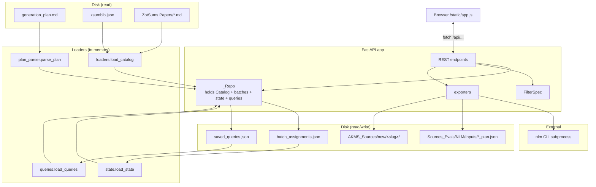
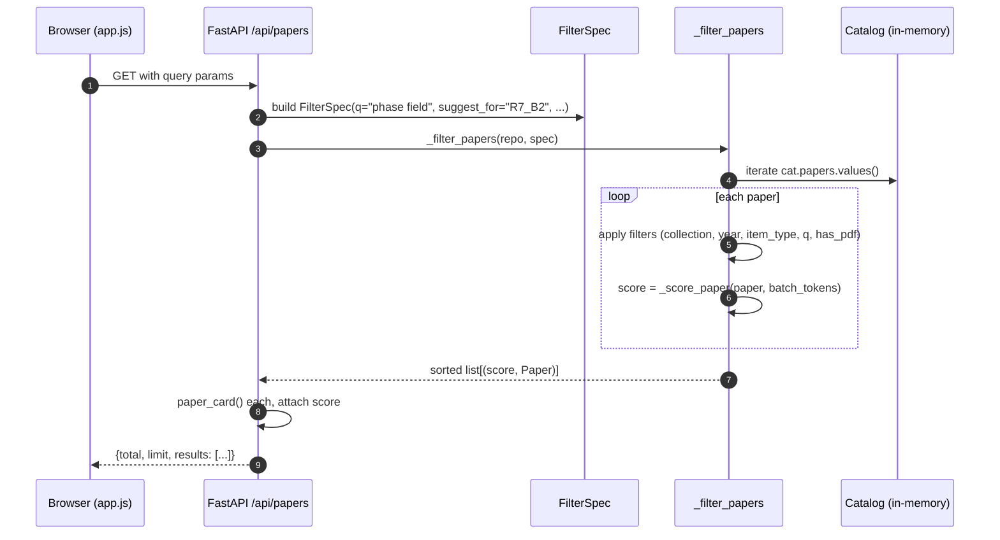
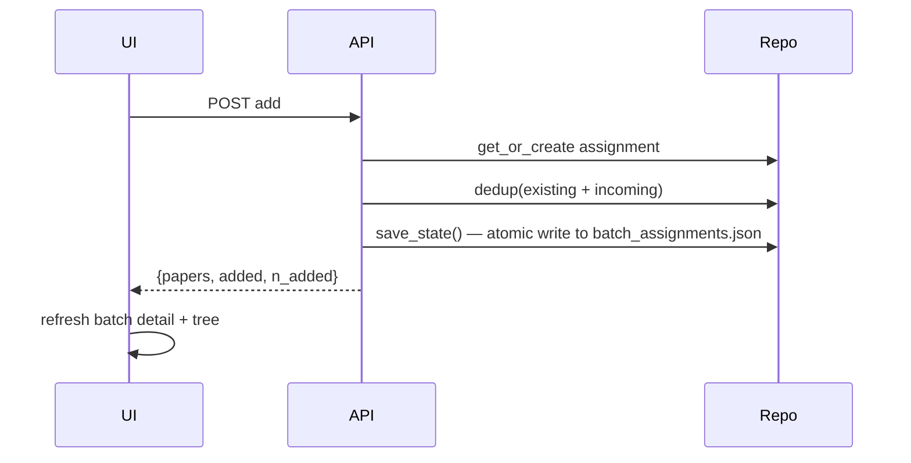

# Architecture

## Module map

```
src/akms_nodes_gen/batch_picker/
├── __init__.py           — package marker
├── __main__.py           — CLI entry (argparse + uvicorn)
├── config.py             — Paths dataclass, env-var resolution
├── plan_parser.py        — generation_plan.md → list[Batch]
├── loaders.py            — zsumbib.json + ZotSums vault → Catalog
├── state.py              — batch_assignments.json read/write
├── queries.py            — saved_queries.json read/write
├── server.py             — FastAPI app, _Repo, FilterSpec, all endpoints
├── exporters.py          — plan JSON, PDF stage, nlm shell-out
└── static/
    ├── index.html        — single-page UI
    ├── app.js            — vanilla JS, no framework
    └── style.css         — dark theme, single file
```

## Layers



## Data model

### Paper (loaders.py)

```python
@dataclass
class Paper:
    citekey: str            # BBT citationKey, primary key
    title: str
    year: str               # parsed from `date` (best-effort regex)
    authors: list[str]
    item_type: str          # journalArticle, book, ...
    doi: str
    url: str
    publication: str        # publicationTitle
    abstract: str           # abstractNote
    tags: list[str]         # Zotero tags
    keywords: list[str]     # ZotSums-curated (frontmatter)
    paper_type: str         # ZotSums classification
    collections: list[str]  # collection names this paper is in
    pdf_path: str           # absolute path to local PDF, if any
    has_pdf: bool
    summary: dict[str, str] # {"Problem": ..., "Methods": ..., ...}
    item_key: str           # Zotero internal itemKey
```

### Batch (plan_parser.py)

```python
@dataclass
class Batch:
    id: str                # "R7_B2"
    round: int             # 7
    round_title: str
    round_theme: str
    round_subdomain: str
    title: str             # "Energy Decomposition & Solution Strategies"
    node_count: int        # declared in `## Rn_Bm — Title (K nodes)` header
    pdf_slug: str          # "R7_B2_pf_energy_solvers"
    sources_text: str      # parsed from `**Sources:** ...`
    zotsums_text: str
    missing_text: str
    cross_refs_text: str
    nodes: list[BatchNode] # parsed from the markdown table
```

### BatchAssignment (state.py)

```python
@dataclass
class BatchAssignment:
    papers: list[str]            # ordered citekeys
    nlm_notebook_id: str
    nlm_notebook_url: str
    synced_at: str               # iso UTC, set after create_notebook
    uploaded_papers: list[str]   # subset of papers
    notes: str                   # free text, unused by UI
```

### FilterSpec (server.py)

```python
class FilterSpec(BaseModel):
    q: str = ""
    collection: list[str] = []
    year_from: int | None = None
    year_to: int | None = None
    item_type: str = ""
    only_with_pdf: bool = False
    suggest_for: str = ""        # batch id; activates suggest scoring
```

The same shape is used by `GET /api/papers` query parameters, `/bulk_add`
request body's `filter` field, and the `filter` of every saved query.

## Request lifecycle

### Reading: `GET /api/papers?q=phase+field&suggest_for=R7_B2&limit=300`



### Writing: `POST /api/batches/R7_B2/papers/add {citekeys: [...]}`



## Persistence model

State is **append-only at the conceptual level**, but every save is a full
rewrite of the JSON file via `tempfile.mkstemp` + `os.replace`, so concurrent
writers are safe (last writer wins, no torn files).

There is **no SQLite, no migrations** — the entire model fits in a few MB
of JSON and reloads in milliseconds. If the schema ever needs versioning,
both files already include a `"version": 1` field.

## Suggest scoring

Pure deterministic keyword overlap. **No LLM, no embeddings.**

### What goes in

**Batch tokens** (`server._batch_tokens`):

- `batch.title`
- `batch.round_title`
- `batch.round_theme`
- For every node: `node.title` + `node_id` with hyphens replaced by spaces (so `pf-at2-regularization` → `pf at2 regularization`)
- `batch.zotsums_text`
- `batch.sources_text`

**Paper tokens** (`server._score_paper`):

- `paper.title`
- Each `paper.keywords` entry
- Each `paper.tags` entry
- `paper.abstract`

### Tokenization rules (`server._tokenize`)

- Regex `[A-Za-z][A-Za-z0-9\-]{2,}` — must start with a letter, ≥3 chars total
- Lowercased
- Stopwords removed: ~50 common English words plus domain noise
  (`method`, `model`, `study`, `paper`, `analysis`, `section`, `ch`, …)

### Score

```python
score = len(batch_tokens & text_tokens)
```

A simple set-intersection size. Intentionally not weighted by frequency,
not IDF-adjusted, not stemmed. **It's a recall aid, not a ranker** — verify
the top results yourself.

### Why no fancier ranker?

The whole point of this tool is to undo a previous failure mode where AI
ranking gave plausible-but-wrong assignments. Deterministic overlap means
the same filter always returns the same scoring; you can audit it; you
won't be surprised by drift.

If you want sharper results, two cheap upgrades worth considering:

1. **Boost title/keyword overlap relative to abstract overlap** — abstracts dilute the signal because they share many generic words.
2. **Penalize papers already assigned elsewhere** — push novel candidates above re-uses.

Both are 5-line changes in `_score_paper`.

## Where state lives at rest

| File | Owner | Schema version |
|------|-------|----------------|
| `Sources_Evals/NLM/batch_assignments.json` | `state.py` | 1 |
| `Sources_Evals/NLM/saved_queries.json` | `queries.py` | 1 |
| `Sources_Evals/NLM/Inputs/<slug>_plan.json` | `exporters.py:write_plan_json` | (driven by `node-gen-invoker` schema) |
| `AKMS_Sources/new/<slug>/<citekey>.pdf` | `exporters.py:stage_pdfs` | symlinks to BBT paths |

Full schemas in [State files](../reference/nodes-gen/batch-picker/state-files.md).

## Concurrency notes

The picker is single-process, single-threaded uvicorn — but FastAPI may
serve concurrent requests from the browser. `_Repo` wraps the catalog,
plan, and state in an `RLock` and saves are atomic, so concurrent UI
actions are safe. The `nlm` shell-out is synchronous (subprocess call
blocks the request) — that's intentional so the resulting notebook ID is
captured before the response returns.

If you're running long uploads with `--wait`, consider hitting the picker
from one tab at a time to keep the UI responsive.
