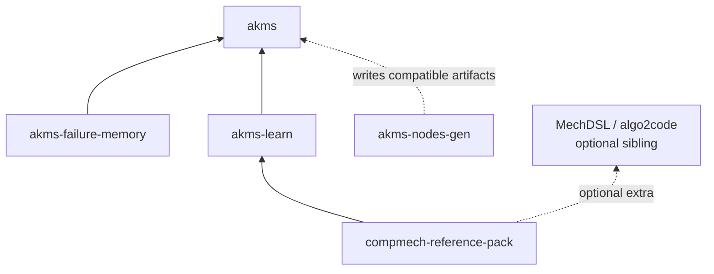

# Module and package boundaries

The repository has package boundaries and, inside core, module boundaries. They
should not be collapsed into one fictional five-module hierarchy.

## Workspace package dependencies

Core does not import failure memory or akms-learn. Node generation exchanges
files and schemas rather than becoming a mandatory runtime dependency.

## Core package map

| Module | Responsibility |
|---|---|
| `akms.schema` | Frozen v2 models, validators, and structured errors |
| `akms.graph` | Build/load, ranked query, loadout, update, status, mirror, drift, cache, tag derivation, and re-evaluation operations |
| `akms.task_context` | Route indexes, seed resolution, required/coactivated/advisory query, manifests, reviewer context, and shared resolve service |
| `akms.cli` | argparse adapters over core services and optional runtime integration |
| `akms.tools` | Standalone validation and utility surfaces |
| `akms.migrations` | Explicit schema/data migrations |
| `akms.agents` | Optional Claude, Codex, CLI, and local runtime adapters |
| `akms.orchestrator` | Optional staged pipeline, checkpoints, MCP exposure, and telemetry helpers |

## Practical dependency guidance

- Schema models should not depend on graph or runtime behavior.
- Graph/task-context services own deterministic semantics; CLI and MCP should be
  thin adapters over them.
- Failure memory may use only the documented pinned public AKMS surface.
- External source projectors are invoked by argv-list subprocess contracts, not
  imported as hidden Python dependencies.
- Project-specific agent subclasses belong in the consuming project, not in
  core.

## Extension points

| Need | Preferred extension |
|---|---|
| New source language/projector | Implement the mirror-provider protocol |
| New required route generator | Emit the v1 route-index contract |
| New agent harness | Call CLI/Python/MCP, or subclass the optional runtime adapter |
| New learning output | Add an `akms-learn` exporter/provider |
| New executable domain | Add a companion adapter such as `compmech-reference-pack` |
| New project lesson workflow | Configure or extend `akms-failure-memory` without making core depend on it |
