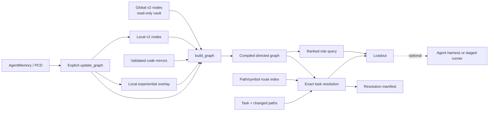

# System design

AKMS separates knowledge ownership, deterministic retrieval, and optional agent
execution.

## Design principles

### Typed source artifacts

Markdown remains human-readable, while Pydantic validation freezes the machine
contract. Invalid schema versions or invalid node frontmatter fail graph
compilation rather than quietly degrading into “helpful” guesses.

### Read-only shared knowledge

The global vault supplies reusable domain nodes. Automated updates are confined
to project-local paths. A local node that collides with a global node ID is
skipped and reported; it does not overwrite the shared node.

### Exact and advisory retrieval are different contracts

Tag queries are appropriate for advisory context. Required knowledge is resolved
from exact source/mirror matches and route indexes, bypasses ordinary caps, and
fails closed when unavailable.

### Generated artifacts have explicit owners

- Mirror providers own source projection.
- AKMS owns graph, selection, loadout, and manifest semantics.
- Project repositories own local nodes, routes, overlays, and failure registries.
- `akms-learn` owns Learning Source Packet compilation.

### Runtime independence

The deterministic surfaces are callable from Python, CLI, or MCP. The optional
pipeline runner and agent adapters sit above them and can be replaced without
changing graph semantics.

## Determinism boundary

For identical validated inputs, graph node/edge ordering, query ranking, route
resolution, and manifest fingerprints are deterministic. Some generated files
also include observational metadata such as timestamps or environment
capabilities, so semantic reproducibility and byte-for-byte identity must not be
conflated. The failure-memory refresh path provides the stronger explicit
`generated_at` publication contract where byte identity is required.
