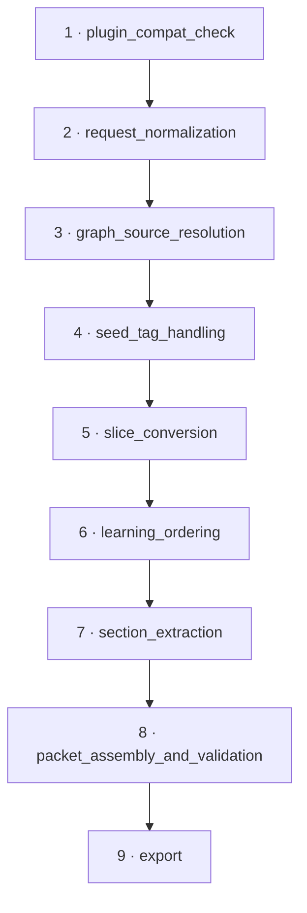

# Core Concepts

This page explains the model behind akms-learn: the packet it produces, the
request that drives it, the pipeline that builds it, and the modes, exporters,
and packs that shape the output.

---

## Learning Source Packet

A **Learning Source Packet (LSP)** is the central artifact: a validated Pydantic
v2 model ([`LearningSourcePacket`](../reference/akms-learn/api-reference.md#models)) that captures
everything needed to render — and later reproduce — a piece of learning
material from a graph slice.

A packet carries:

| Block | Type | Holds |
|---|---|---|
| `packet_id` | `str` | Deterministic id derived from request + graph hashes. |
| `created_at` | `str` | ISO timestamp — the **only** non-deterministic field. |
| `compiler` | `CompilerInfo` | Compiler name, version, plugin API. |
| `source` | `SourceInfo` | `graph_hash`, `graph_path`, `query_hash`. |
| `request` | `LearningRequestInfo` | The normalized request snapshot + `request_hash`. |
| `body` | `PacketBody` | Node, edge, pitfall, code-link, and reference views; `reading_order`. |
| `warnings` | `list[LearningWarning]` | Soft issues accumulated during compilation. |

The schema string is `learn/v0.1`. Every view in the body carries **required
provenance** — `node_id`/`edge_id`, `source_path`, and `line_range` — so a
packet can always be traced back to the graph that produced it.

!!! note "Determinism contract"
    Two compiles of the same request against the same graph produce byte-equal
    packets *except* for `created_at`. The `packet_id` itself is deterministic:
    `lsp-<request_hash[:16]>-<graph_hash[:8]>`. No UUIDs, no per-call entropy.

---

## LearningRequest

A [`LearningRequest`](../reference/akms-learn/api-reference.md#requests) describes *what* to compile.
Only **eleven canonical fields** contribute to the request's identity (its
hash). Any other key — including caller-side UI state like `preview_mode`,
`ui_theme`, or `session_id` — is silently dropped before hashing.

| # | Field | Type | Default | Normalization |
|---|---|---|---|---|
| 1 | `topic` | `str` | *(required)* | trimmed, case preserved |
| 2 | `goal` | `str` | *(required)* | trimmed, case preserved |
| 3 | `audience` | `str` | `"engineer"` | trimmed + lowercased |
| 4 | `depth` | `str` | `"implementation"` | trimmed + lowercased |
| 5 | `generation_option` | `str` | *(required)* | trimmed + lowercased |
| 6 | `seed_tags` | `list[str]` | `[]` | trimmed + lowercased + sorted |
| 7 | `max_nodes` | `int \| None` | `None` | coerced to int |
| 8 | `max_depth` | `int \| None` | `None` | coerced to int |
| 9 | `include_pitfalls` | `bool` | `True` | coerced to bool |
| 10 | `include_code_links` | `bool` | `True` | coerced to bool |
| 11 | `exporters` | `list[str]` | `[]` | trimmed + lowercased + sorted |

!!! note "Fields that intentionally do *not* hash"
    `LearningRequest` also carries `required_capabilities`, `policy`,
    `granularity`, `learner_profile`, and the LLM-expansion fields (`llm_enable`,
    `llm_provider`, `llm_policy`, `sources`). These are **excluded** from the
    hash on purpose: two requests that differ only in these address the same
    topic/goal and must hash identically. They influence rendering or capability
    gating, not request identity.

---

## Request hashing and determinism

The compiler reduces a request to its canonical form with
[`normalize_request`](../reference/akms-learn/api-reference.md#requests) — exactly the eleven fields
above, extras dropped, lists sorted — then hashes it with
[`request_hash`](../reference/akms-learn/api-reference.md#requests):

```python
from akms_learn import normalize_request, request_hash

canonical = normalize_request({
    "topic": "j² return mapping",
    "goal": "Understand it",
    "generation_option": "deterministic_outline",
    "ui_theme": "dark",   # dropped — never reaches the hash
})
digest = request_hash(canonical)   # 64-char SHA-256 hex
```

The digest is byte-stable across Python sessions and platforms because the
canonical JSON uses `sort_keys=True`, `separators=(",", ":")`, and
`ensure_ascii=False` (so non-ASCII topics like `"j² return mapping"` hash
consistently regardless of locale). The same digest names the on-disk packet
file (`<request_hash>.json`) and seeds the deterministic `packet_id`.

---

## Generation modes

The request's `generation_option` selects a **mode** — a deterministic
graph-to-content transformation. Modes that ship today:

### `deterministic_outline`

Pure graph-to-outline transform: derives the learning goal, builds a
prerequisite list from `requires` edges, lays out a core path from the ordered
nodes, attaches implementation/derivation branches and pitfalls, and emits a
`reading_order` and concept-map data. No LLM, no randomness — the byte-stable
default.

### `anthology`

An ordered "mini-reader" compiled from each node's extracted sections. Respects
`reading_priority` (lower comes first), surfaces confidence and status badges,
and warns when teaching-oriented sections (`Learning goal`, `Main path`,
`Implementation`, `Self-check`) are missing.

### `pitfall`

A failure-mode-driven walk. Detects pitfall edges, builds
symptom/cause/correction/diagnostics sections, links each pitfall to its source
node, pulls in corrective concepts via `requires`/adjacent edges, and warns when
a pitfall edge lacks explanatory content.

### `bundle` / bundle source

The cross-mode aggregator (Mode 12) that drives the seven-artifact review
bundle. In practice you select it via the `bundle` **exporter** rather than as a
`generation_option`; see [Exporters](#exporters).

### Additional modes

The package also implements `llm_expanded`, `adaptive_path`, and
`multi_granularity`, plus several additional pedagogical modes
(`derivation_first`, `implementation_first`, `pedagogical_template`,
`assessment_first`, `notebook_source`):

- **`llm_expanded`** — captures the deterministic packet *first*, then optionally
  attaches source-locked LLM prose under `generated_sections`. Disabled by
  default (`llm_enable=False`), in which case output is byte-identical to the
  deterministic baseline. Non-stub providers require the `llm` extra.
- **`adaptive_path`** — learner-profile-guided prerequisite filtering. Strictly
  conservative by default (no prerequisite is ever skipped). Capability-gated on
  the `llm` extra.
- **`multi_granularity`** — emits `overview` / `standard` / `deep_dive` variants
  from the `granularity` field. Because `granularity` is excluded from the hash,
  variants change rendered output without changing request identity.

!!! tip "Choosing a mode"
    Start with `deterministic_outline`. Reach for `anthology` when you want a
    readable lesson from rich node bodies, and `pitfall` when failure modes are
    the point. See [Choosing a generation mode](../reference/akms-learn/usage.md#choosing-a-generation-mode).

---

## The nine-stage pipeline

[`compile_learning_source`](../reference/akms-learn/usage.md#python-api) runs nine fixed-order stages,
exported as the `STAGES` tuple. Each stage name is appended to
`CompileResult.stage_log` after it completes, so a successful run always ends
with `stage_log == STAGES`.



1. **plugin_compat_check** — verify the requested `akms_schema` (default `v2`)
   and any `required_capabilities` are available; raise
   `LearningCapabilityError` otherwise.
2. **request_normalization** — reduce the request to its eleven canonical fields
   and compute `request_hash`.
3. **graph_source_resolution** — resolve `graph_slice` / `graph_path` into a
   validated `GraphSlice` and compute `graph_hash`.
4. **seed_tag_handling** — build a *fresh* filtered slice retaining nodes whose
   tags intersect `seed_tags` (input is never mutated).
5. **slice_conversion** — copy each node dict into an id-keyed map.
6. **learning_ordering** — dispatch through the mode-specific ordering strategy
   to produce the `reading_order`.
7. **section_extraction** — extract approved sections from each node's markdown.
8. **packet_assembly_and_validation** — assemble the `PacketBody`, build the
   packet, run `validate_packet`, and round-trip-check it.
9. **export** — dispatch requested exporters and (if `output_dir` is set) write
   the canonical packet JSON.

---

## Exporters

Exporters render a packet to files. They are **dispatched by the compiler** in
Stage 9 — you never call an exporter directly. The request's `exporters` list
drives the dispatch, and produced artifacts surface on
`CompileResult.export_paths`.

`KNOWN_EXPORTERS` is the single source of truth for the names the compiler will
attempt to dispatch:

| Exporter | Output |
|---|---|
| `markdown` | A rendered `lesson.md`. |
| `bundle` | The seven-artifact review bundle (LSP YAML, `manifest.json`, `lesson.md`, `concept_map.json`, `provenance.json`, `warnings.json`, plus `exports/` and `assets/` directories). |
| `notebook` | Jupyter-notebook export (needs the `notebook` extra). |
| `assessment` | Assessment-item export. |
| `html` | HTML preview export (needs the `html` extra). |

Every exporter is **pure and deterministic**: same packet in → byte-equal
artifacts out (the LSP YAML's `created_at` is the one exception). An unknown
exporter name never raises — it emits a `LearningWarning(code="exporter_unavailable")`
and is skipped.

---

## Domain packs and source packs

**Domain packs** and **source packs** are *metadata-only* descriptors loaded from
YAML at runtime. They let a packet record companion-tool and source provenance
without ever importing a companion package.

- A **domain pack** (`domain_pack.yaml`) describes a domain and its companion
  roles. Loaded into a [`DomainPackRegistry`](../reference/akms-learn/api-reference.md#domain-packs); the
  ordered descriptors are attached to `body.domain_pack_provenance`.
- A **source pack** (`source_pack.yaml`) describes upstream sources; its
  descriptors are attached to `body.source_pack_provenance`.

You pass them to the compiler via `domain_pack_paths` / `source_pack_paths` (a
directory containing a `domain_pack.yaml` is auto-resolved). A missing path
raises `LearningCapabilityError`. No file in the domain-pack subpackage may
import a companion package — companion names are carried as strings.

---

## Soft warnings vs validation errors

akms-learn distinguishes two failure modes:

- **Soft warnings** — [`LearningWarning`](../reference/akms-learn/api-reference.md#models) entries
  (`info` / `warning` / `error` severity) accumulated across stages. They land on
  `packet.warnings` and `CompileResult.warnings` and **never abort** the compile.
  Examples: a missing teaching section, a dangling reference, an unavailable
  exporter.
- **Hard errors** — exceptions that abort compilation:
    - `PacketValidationError` — the assembled packet violates a hard cross-field
      invariant.
    - `LearningCapabilityError` — a required capability or a domain/source-pack
      path is unavailable.

!!! warning "Validation returns warnings, but assembly can still raise"
    `validate_packet` returns a *list* of soft warnings — it does not raise for
    soft issues. A `PacketValidationError` is raised only on a hard invariant
    breach during Stage 8 assembly.

---

## Next steps

- Put these concepts to work in the [Usage guide](../reference/akms-learn/usage.md).
- See the exact signatures in the [API Reference](../reference/akms-learn/api-reference.md).
