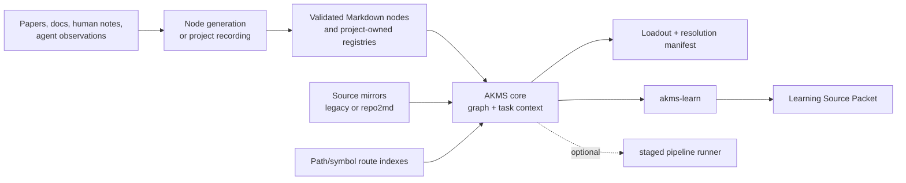

# AKMS

**Adaptive Knowledge Management System** is a family of tools for turning
project and domain knowledge into deterministic, inspectable inputs for agents,
reviewers, learning workflows, and executable-domain adapters.

The system is deliberately split into narrow responsibilities rather than one
omnivorous agent framework:

-   :material-graph: __[AKMS Core](reference/akms/index.md)__

    ---

    Compiles frozen-v2 knowledge nodes into a directed graph, performs ranked
    and exact task-context resolution, and emits loadouts and manifests.

-   :material-memory: __[Failure Memory](reference/failure-memory/index.md)__

    ---

    Optional project-owned failure/lesson history with deterministic recording,
    compilation, refresh, provider, and CI workflows.

-   :material-school: __[akms-learn](reference/akms-learn/index.md)__

    ---

    Consumes a graph slice read-only and compiles a validated Learning Source
    Packet with Markdown, bundle, HTML, notebook, and other exporters.

-   :material-database-import: __[Node Generation](reference/nodes-gen/index.md)__

    ---

    Batch Picker and generation tools for turning source collections into
    validated AKMS nodes, including a NotebookLM CLI path.

    ---

    Optional companion adapter that bridges computational-mechanics LSP
    excerpts to the MechDSL executable backend while preserving provenance.

## The central boundary

AKMS core is the knowledge boundary in this diagram. The staged runner is an
optional consumer and coordinator. You can use the graph, CLI, exact task
resolution, MCP tools, learning compiler, or failure-memory provider without
running that pipeline.

## Ownership at a glance

| Artifact | Canonical owner |
|---|---|
| Global domain nodes | Human-curated vault |
| Local nodes and experiential overlay | Project repository |
| Code mirrors | Selected mirror provider, projected into the project |
| Route indexes | Project repository or its deterministic generator |
| Loadouts and manifests | Generated AKMS artifacts |
| Failure-memory registry | Project repository |
| Learning Source Packets | `akms-learn` output directory |
| Executable mechanics artifacts | Companion adapter output directory |

No component silently promotes project experience into the global vault.

## Start here

| Goal | First page |
|---|---|
| Build and query a local graph | [Core quickstart](getting-started/akms/quickstart.md) |
| Resolve required knowledge from task paths and symbols | [Exact task resolution](reference/akms/user-guide/task-resolution.md) |
| Generate or refresh source mirrors | [Mirror providers](reference/akms/user-guide/mirror_providers.md) |
| Record and compile project failures/lessons | [Failure Memory](getting-started/failure-memory.md) |
| Compile learning material | [akms-learn getting started](getting-started/akms-learn.md) |
| Generate nodes from paper batches | [Node Generation](reference/nodes-gen/index.md) |
| Use the optional agent pipeline | [Pipeline runner](reference/akms/user-guide/orchestrator.md) |
