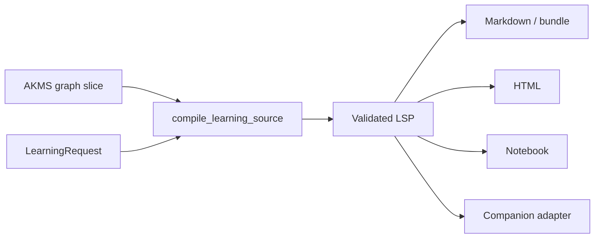

# akms-learn — Learning Source Packet compiler

`akms-learn` turns a read-only AKMS graph slice plus a learning request into a
validated Learning Source Packet (LSP) and one or more exported artifacts.

- Distribution: `akms-learn`
- Import: `akms_learn`
- Python: `>=3.11,<3.14`
- CLI: `akms-learn`
- Core dependency direction: `akms-learn → akms`, never the reverse

## Pipeline

The default compiler path is deterministic and read-only with respect to the
input graph. Optional expansion/provider modes have explicit capability gates.

## Capabilities

- Deterministic outlines and node anthologies
- Pitfall-driven learning walks and assessment-first modes
- Validated Pydantic packet model with provenance
- Markdown, bundle, HTML, notebook, quiz, and related exporters
- Domain/source-pack descriptors
- Optional grounded NotebookLM provider via external `nlm` CLI
- Plugin boundary for companion adapters

`nbformat` and Jinja2 are base dependencies. The historical `notebook` and
`html` extras remain empty compatibility sentinels so older install commands
continue to resolve.

## Start

See [Getting Started](../../getting-started/akms-learn.md), then [Core Concepts](../../concepts/akms-learn.md) and
[Usage](usage.md).
