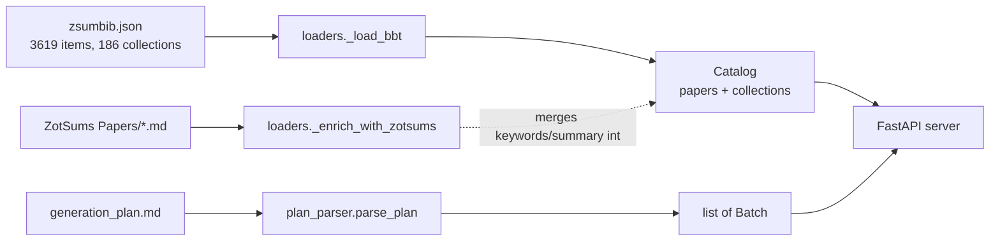

# Data sources

The picker reads from three places on disk. None of them are written to.

## 1. Zotero BetterBibTeX export — `zsumbib.json`

The single largest input. Generated by Zotero's
[Better BibTeX](https://retorque.re/zotero-better-bibtex/) plugin in
"BetterBibTeX JSON" auto-export mode.

### Top-level shape

```json
{
  "config": { ... },
  "version": "...",
  "collections": { "<colKey>": { ... } },
  "items":       [ { ... }, ... ]
}
```

Default location:
`~/ZotSums/zsumbib.json`
(override with `AKMS_BBT_JSON`).

### Items

Each item provides everything in the [`Paper` model](../../../architecture/batch-picker.md#paper-loaderspy):

| BBT field | Used as |
|-----------|---------|
| `citationKey` | Primary key |
| `title` | Paper title |
| `date` | Year is regex-extracted (`19xx` / `20xx` / `21xx`) |
| `creators[]` | Authors — flattened to `"Last, First"` strings |
| `itemType` | Filter facet |
| `DOI`, `url` | Modal links |
| `publicationTitle` | Modal display |
| `abstractNote` | Search haystack |
| `tags[].tag` | Search haystack + chips |
| `attachments[].path` | Local PDF path (only used if absolute and `.pdf`) |
| `itemID` | Used to join with `collections[*].items[]` (which is a list of integer item IDs) |

### Collections

```json
"collections": {
  "LY4X6LF4": {
    "key": "LY4X6LF4",
    "parent": "",
    "name": "Computational",
    "collections": ["GAH9J55P", ...],   // child collection KEYS
    "items": [1748, 2148, 2302, ...]    // member item IDs (integers)
  },
  ...
}
```

Joined to papers by mapping each `itemID` back to a citationKey, then
attaching the collection name to every member paper's `collections` field.
Parent name is derived by reversing the `collections` (children) field of
each parent record.

!!! note "Why itemID, not itemKey"
    Earlier versions joined on `itemKey` (string) and got zero hits because
    `cols.items[]` actually contains the integer `itemID` field.
    `loaders._load_bbt` resolves this correctly.

## 2. ZotSums vault (Obsidian)

Default location: `~/.../ZotSums/` — set `AKMS_ZOTSUMS_ROOT` to override.

```
ZotSums/
├── Papers/
│   ├── @<citekey>.md          ← one file per paper
│   └── ...
├── Collections/
│   ├── <name>.md              ← one file per Zotero collection
│   └── ...
├── Library Index.md
├── zsumbib.json               ← (the BBT export, by convention placed here)
└── config.yaml
```

### `Papers/@<citekey>.md` frontmatter (read)

```markdown
---
type: paper
citekey: "goswamiAdaptiveFourthorderPhase2020"
year: 2020
paper_type: "research"
authors:
  - Goswami, Somdatta
keywords:
  - Fourth-order phase field
  - Isogeometric analysis
  - PHT-splines
  - ...
---

# <citekey> — <title>

## Problem
...

## Methods
...

## Key Findings
...

## Limitations
...
```

What the picker pulls per paper:

| Frontmatter field | Used as |
|-------------------|---------|
| `keywords` | `Paper.keywords` — chips in the table + token bag for search/scoring |
| `paper_type` | `Paper.paper_type` (currently informational only) |

H2 sections (`Problem`, `Methods`, `Key Findings`, `Limitations`) populate
`Paper.summary` and show up in the [paper modal](ui-tour.md#paper-modal).

Placeholder values `*Pending*` and `*None noted*` are filtered out.

### `Collections/*.md`

The picker does **not** parse collection markdown files (the canonical
membership list comes from `zsumbib.json`'s `collections` field). The
ZotSums collection markdown is human-readable summary content; ignore it
from a tooling perspective.

## 3. `generation_plan.md` (the batch plan)

Default: `Packages/AKMS_nodes_gen/generation_plan.md`. Override with
`AKMS_PLAN_MD`.

The parser is intentionally lenient about ordering and tolerates extra
prose, but it expects this overall shape:

```markdown
# Round 7: Phase-Field Fracture Methodology

**Theme:** Variational fracture, regularization, energy decomposition...
**Subdomain:** `phase-field` / `damage-mechanics`
**Dependencies:** Round 1, Round 2, Round 3

## R7_B2 — Energy Decomposition & Solution Strategies (7 nodes)

**PDF folder:** `AKMS_Sources/new/R7_B2_pf_energy_solvers/`
**Sources:** Wu et al. 2020 (CMAME), Borst-Crisfield Ch. 8, ...
**ZotSums:** `PFfrac` → `@wuComprehensiveImplementationsPhasefield2020`
**Missing sources (retrieve from Zotero):** Tanné et al. 2018

| # | Node ID | Title | Key Concepts | Size |
|---|---------|-------|--------------|------|
| 1 | `pf-at1-regularization` | AT1 regularization | ... | medium |
| ... |

**Cross-references:** see R7_B1 for variational basis
```

### Parser rules

| Pattern | Captured as |
|---------|-------------|
| `^# Round (\d+):\s*(.+)$` | Round number + title |
| `^## R\d+_B\d+ — (.+) \((\d+) nodes?\)$` | Batch ID + title + declared node count |
| `^**Theme:**` (round-level) | `round_theme` |
| `^**Subdomain:**` (round-level) | `round_subdomain` |
| `^**PDF folder:** ...AKMS_Sources/new/<slug>/...` | `pdf_slug` |
| `^**Sources:** ...` | `sources_text` (free text) |
| `^**ZotSums:** ...` | `zotsums_text` |
| `^**Missing sources (...):** ...` | `missing_text` |
| `^**Cross-references:** ...` | `cross_refs_text` |
| First markdown table after the header | `nodes` table — extracts ID (backticks), title, size columns |

### Tolerance

- Field labels are case-insensitive at the parser level (`**SOURCES:**` works).
- `^---` divider is treated as end-of-batch even mid-stream.
- Extra free-text paragraphs between fields are ignored.
- A header declaring `(11 nodes)` against a 10-row table is **logged in the
  UI** as `10/11` but is not an error — the parser uses what it actually
  reads.

### What's deliberately **not** parsed

- Free-text narrative outside the field labels and the node table
- Per-node attribute lists or links
- Anything in subsequent `###` subsections

These are useful for humans but the picker is built around explicit
citekey assignments, not the freeform source text.

## How they combine



The catalog is fully built once at startup, retained in memory, and
reloaded only on `POST /api/reload` or process restart.
