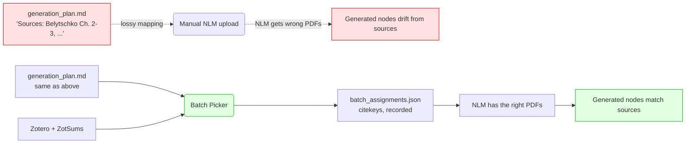

# Batch Picker

A local FastAPI web UI for curating AKMS NotebookLM batches by hand instead of
relying on the lossy free-text source lists in `generation_plan.md`.

## Why it exists

A previous eval discovered NotebookLM notebooks ending up with sources unrelated
to the questions asked of them — symptom of mapping lines like
`Belytschko Ch. 2-3, ...` onto Zotero papers by hand. The picker makes paper
assignment **explicit** and **persisted**.

## What you get

- :material-table: **Two-pane UI** — batch tree on the left, filterable paper picker on the right.
- :material-magnify: **Filters** — full-text search across title/citekey/keywords/abstract, multi-select collections, year range, item type, "only with PDF".
- :material-target: **Suggest-for-batch ranking** — deterministic keyword overlap with the batch's nodes; see [Architecture › Suggest scoring](../../../architecture/batch-picker.md#suggest-scoring).
- :material-content-save: **Saved queries** — named filter specs, persisted across sessions.
- :material-checkbox-multiple-marked: **Bulk add / replace** — push every match of the current filter into the active batch in one click.
- :material-compare: **Side-by-side compare** — three-column diff (only-A / both / only-B) of any two batches' assignments, with bulk Move/Copy/Remove buttons.
- :material-arrow-right-bold: **Copy-to-batch popover** — click = copy, ++shift+++click = move; works on assigned-paper pills and on each search-result row.
- :material-rocket-launch: **End-to-end pipeline buttons** — Write plan JSON, Stage PDFs (symlinks into `AKMS_Sources/new/<slug>/`), Create NLM notebook (drives the `nlm` CLI).
- :material-database: **Durable record** — every notebook ID and uploaded paper lives in `Sources_Evals/NLM/batch_assignments.json` so reruns only upload the delta.

## Quick links

- [UI tour](ui-tour.md) — every button, every filter
- [HTTP API reference](api-reference.md) — every endpoint, every payload
- [Architecture](../../../architecture/batch-picker.md) — module map, data flow, scoring algorithm
- [Configuration](configuration.md) — environment overrides
- [Data sources](data-sources.md) — what BBT/ZotSums fields are read
- [State files](state-files.md) — schemas of `batch_assignments.json`, `saved_queries.json`, plan JSON
- [Pipeline integration](pipeline-integration.md) — handoff to `node-gen-invoker`
- [Troubleshooting](troubleshooting.md) — common failures and fixes
