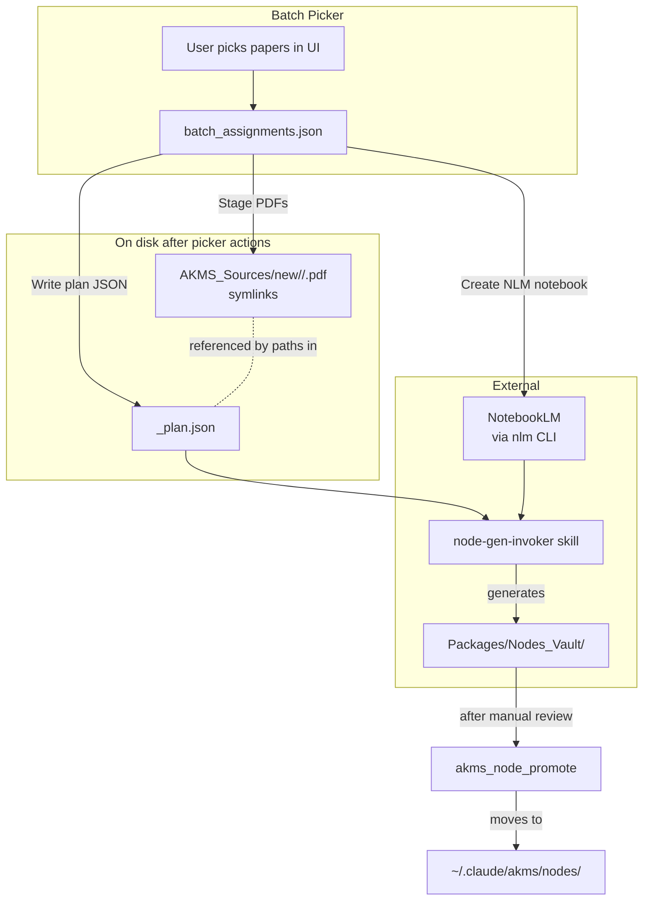

# Pipeline integration

The picker is one stage in a longer chain. This page shows how its outputs
feed `node-gen-invoker` and how the picker stays the **source of truth** even
after the extraction runs.

## The full flow



## Plan JSON shape (what `node-gen-invoker` consumes)

The picker's `Write plan JSON` produces a file in
`Sources_Evals/NLM/Inputs/<slug>_plan.json`:

```json
{
  "plan": "Round 7 — Phase-Field Fracture Methodology",
  "batch_id": "R7_B2",
  "batch_title": "Energy Decomposition & Solution Strategies",
  "round": 7,
  "subdomain": "phase-field / damage-mechanics",
  "total_nodes": 7,
  "new_nodes": 7,
  "existing_nodes": 0,

  "notes": {
    "source_convention": "Sources picked manually via batch_picker UI; one NLM notebook per batch.",
    "notebook_setup": "Upload 12 PDFs from AKMS_Sources/new/R7_B2_pf_energy_solvers/",
    "round": 7
  },

  "notebook_sources": [
    "Wu et al. (2020) — A comprehensive implementation of the phase-field damage theory in CMAME",
    "..."
  ],

  "papers_by_citekey": [
    {
      "citekey": "wuComprehensiveImplementationsPhasefield2020",
      "label": "Wu et al. (2020) — A comprehensive implementation ...",
      "pdf": "~/wuComprehensive...pdf",
      "has_pdf": true
    },
    "..."
  ],

  "clusters": [
    {
      "cluster": "R7_B2",
      "name": "Energy Decomposition & Solution Strategies",
      "notebook_sources": [...],
      "nodes": [
        {"id": "pf-at1-regularization", "title": "AT1 regularization", "size": "medium", "status": "new"},
        "..."
      ]
    }
  ],

  "nlm": {
    "notebook_id": "nb_abc123",
    "notebook_url": "",
    "uploaded_papers": ["wuComprehensiveImplementationsPhasefield2020"]
  },

  "generated_at": "2026-05-07T15:48:18Z"
}
```

Two key blocks:

- **`notebook_sources`** — free-text labels in the legacy shape that
  `node-gen-invoker` already understands. Sufficient for back-compat.
- **`papers_by_citekey`** — the *new*, source-of-truth mapping. Each entry
  carries the BBT citekey and the absolute PDF path. Downstream tools
  should prefer this list — it's audit-friendly and citekey-stable.

## Running the extraction

The exact incantation lives in the `node-gen-invoker` skill. The canonical
form looks like:

```bash
/node-gen-invoker <NLM_ID> all \
    Sources_Evals/NLM/Inputs/R7_B2_pf_energy_solvers_plan.json \
    Sources_Evals/NLM/Outputs/R7_B2_pf_energy_solvers/ \
    true
```

Where `<NLM_ID>` is the same notebook ID the picker captured into
`batch_assignments.json` and into the plan JSON's `nlm.notebook_id` field.
You can recover it from either source:

```bash
# from the assignment file
jq -r '.batches.R7_B2.nlm_notebook_id' Sources_Evals/NLM/batch_assignments.json

# or from the plan
jq -r '.nlm.notebook_id' Sources_Evals/NLM/Inputs/R7_B2_pf_energy_solvers_plan.json
```

## After extraction

`node-gen-invoker` writes generated nodes into
`Sources_Evals/NLM/Outputs/<slug>/`. From there:

1. **Review** — manually QA each node (front-matter, citations, schema validity).
2. **Validate** — run [`validate_nodes.py`](../tools/validate-nodes.md) to cross-check against the source notebook.
3. **Promote** — once a node is verified, run
   [`akms_node_promote`](../tools/akms-node-promote.md) to copy it into the
   global vault (`~/.claude/akms/nodes/`) where the AKMS graph is built from.

The picker is **read-only** for any of these later stages — it doesn't
write to `Outputs/`, `Packages/Nodes_Vault/`, or the global vault. Its role
ends at producing the plan + the notebook.

## Reruns and partial state

Because every UI action is durably recorded, you can stop and resume at
any boundary:

| State | What happens on rerun |
|-------|----------------------|
| Closed the picker mid-curation | All assignments persist in `batch_assignments.json`. Reopen, re-select the batch, continue. |
| `Stage PDFs` succeeded but you added more papers | Re-run `Stage PDFs`. Existing symlinks are replaced; new ones created. |
| `Create NLM notebook` partially failed | Re-run it. Only `papers - uploaded_papers` are uploaded. |
| Re-ran `Write plan JSON` after editing assignments | Plan file is overwritten with the current state. Rerun `node-gen-invoker` against the new plan. |

## When to *not* use the picker

- **Adjusting the plan structure** (adding/removing batches, renaming nodes) — edit `generation_plan.md` directly. The picker reads it, doesn't write it.
- **Curating the global vault** — that's `akms_node_promote`'s job, downstream of the picker.
- **Editing generated nodes** — direct file edits in `Packages/Nodes_Vault/` are the right path.
