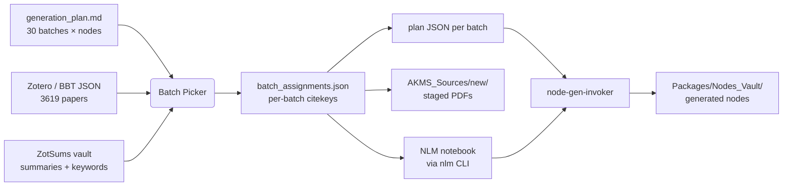

# AKMS Node Generation

Tooling that turns NotebookLM-curated paper collections into validated AKMS
knowledge nodes — and the local web UI that decides **which papers go into
which notebook**.

!!! info "Where this fits in AKMS"
    AKMS keeps domain knowledge as a directed graph of nodes
    (`Packages/Nodes_Vault/<domain>/<id>.md`). Generating those nodes from
    primary sources happens in batches: each batch maps to one NotebookLM
    notebook holding a focused set of PDFs. This package is the toolchain
    for **defining**, **populating**, and **extracting** those batches.

## What's in the box

| Tool | What it does | Entry point |
|------|--------------|-------------|
| [**Batch Picker**](batch-picker/index.md) | Local web UI for hand-assigning Zotero papers to NLM batches, then launching the upload + extraction pipeline. | `akms-pick` |
| [nlm_batch](tools/nlm-batch.md) | Serially generates one batch from that batch's NotebookLM notebook using external prompt/template/source parameters and local validation gates. | `python -m akms_nodes_gen.nlm_batch` |
| [generate_nodes_pipeline](tools/generate-nodes-pipeline.md) | Batch-runs the AI extraction over inventory JSONs and writes node markdown. | `python -m akms_nodes_gen.generate_nodes_pipeline` |
| [validate_nodes](tools/validate-nodes.md) | Checks generated nodes against their source notebook. | `python validate_nodes.py` |
| [akms_node_promote](tools/akms-node-promote.md) | Moves verified nodes from staging into the global vault. | `python -m akms_nodes_gen.akms_node_promote` |
| [extract_framework_nodes](tools/extract-framework-nodes.md) | Converts deepwiki-eval results into framework nodes. | `python extract_framework_nodes.py` |

## The problem the picker solves

The `generation_plan.md` lists 30 batches like this:

```
## R7_B2 — Energy Decomposition & Solution Strategies (7 nodes)
**Sources:** Wu et al. 2020 (CMAME comprehensive), Borst-Crisfield Ch. 8, ...
```

Free-text source lines work for humans but lose specificity in flight: an eval
discovered NLM notebooks ending up with sources unrelated to the questions
they were asked. The Batch Picker replaces the freeform line with **explicit,
recorded, per-batch citation-key assignments**:



## Quick links

- :material-rocket-launch: **[Install & first run](../../getting-started/nodes-gen/install.md)** — get the picker on screen in two commands
- :material-school: **[Tutorial](../../getting-started/nodes-gen/tutorial.md)** — populate one batch end-to-end
- :material-book-open-variant: **[UI tour](batch-picker/ui-tour.md)** — every button explained
- :material-api: **[HTTP API](batch-picker/api-reference.md)** — every endpoint, every payload
- :material-cog: **[Configuration](batch-picker/configuration.md)** — environment overrides
- :material-bug: **[Troubleshooting](batch-picker/troubleshooting.md)** — common failures
- :material-history: **[Changelog](changelog.md)** — package-level changes
